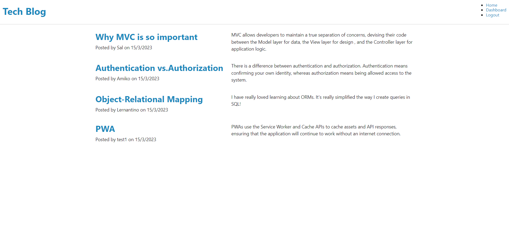
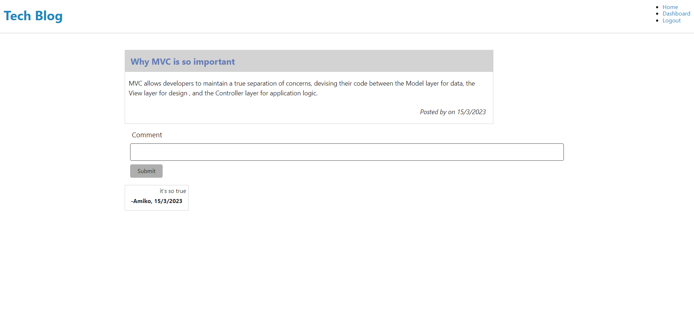
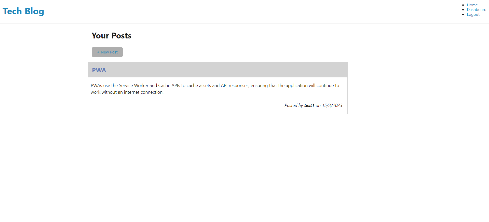
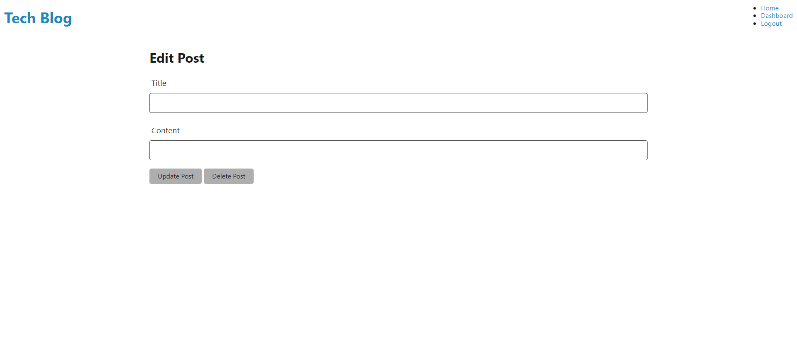

# Tech-Blog
This application is a CMS-style blog site, where developers can publish their blog posts and comment on other developers’ posts as well. It is deployed to Heroku. This app follows the MVC paradigm in its architectural structure, using Handlebars.js as the templating language, Sequelize as the ORM, and the express-session npm package for authentication.

## Table of Contents
  * [User Story](#user-story)
  * [Installation](#installation)
  * [Heroku Link](#heroku-link)
  * [Application Screenshot](#application-screenshot)
  * [Questions](#questions)  

## User Story
```md
AS A developer who writes about tech
I WANT a CMS-style blog site
SO THAT I can publish articles, blog posts, and my thoughts and opinions
```

## Installation
- Install required node pacakges by running:
    ```bash
    npm i
    ```
- To seed the data and start the app by entering
    ```
    node seeds/seed.js
    ```
    ```
    npm start
    ```

## Heroku Link
This application is deployed to [Heroku](https://tech-blog-s.herokuapp.com/)

## Application Screenshot
This is the homepage, it shows all the posts including the post title and the date created.


When you click the post title, it will bring you to the single post page, it shows the post information and comments. You can make a comment while logged in.


When you click dashboard, it bring you to the page below. It shows all your posts, you can click "+ New Post" to add a new post. 


Also, you can click the post title, it brings you to another page, where you can delete post or update the post. 


## Questions
If you have any questions, you can find [my Github](https://github.com/PennyLIU2022) and reach me by email at: pennyliu806@gmail.com
